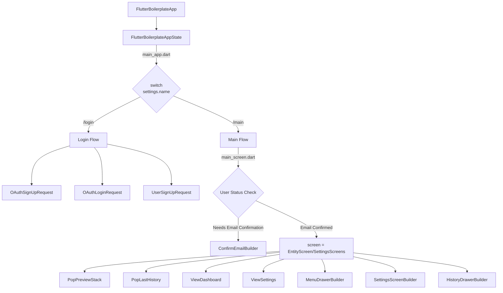

# Flutter Boilerplate

A comprehensive Flutter project boilerplate with modular architecture and deployment automation.

## Table of Contents

- [Quick Start](#quick-start)
- [Project Setup](#project-setup)
- [Module Generation](#module-generation)
- [Development](#development)
- [Deployment](#deployment)
- [Firebase Configuration](#firebase-configuration)
- [Documentation](#documentation)
- [App Flow Documentation](#app-flow-documentation)
- [Additional Notes](#additional-notes)

## Quick Start

### Prerequisites
```bash
fvm install 3.29.3
fvm use 3.29.3
```

### Run Locally
```bash
fvm flutter run
# For web with CORS disabled
fvm flutter run -d chrome --web-browser-flag="--disable-web-security"
```

### Build Runner (for code generation)
```bash
fvm flutter pub run build_runner watch --delete-conflicting-outputs
```

## Project Setup

### App Configuration
App logo must be placed at: `assets/{appType}/images/icon.png`

### Environment Management
```bash
# Create new app environment
./env.sh create boilerplate

# Set active app environment
./env.sh set boilerplate

# Delete app environment
./env.sh delete boilerplate
```

### Generate App Icons
```bash
fvm flutter pub run flutter_launcher_icons
```

## Module Generation

Use the module generation script to create new modules with the following pattern:
```bash
./module.sh make flutter_boilerplate <module_name> <singular> <plural> <plural_display> <fields>
```

### Available Modules

#### Notifications
```bash
./module.sh make flutter_boilerplate notification notification notifications notifications title:String,body:String,type:String,channel:String,actionUrl:String,payload:String,priority:String
```

#### Workout
```bash
./module.sh make flutter_boilerplate workout workout workouts workouts type:String,startTime:int,endTime:int,duration:int,distance:int,averagePace:int,caloriesBurned:int,elevationGain:int
```

#### Photos
```bash
./module.sh make flutter_boilerplate photo photo photos photos category:String,storageType:int,url:String,isProcessed:bool,tags:String
```

#### Social
```bash
./module.sh make flutter_boilerplate social social socials socials userDisplayName:String,userPhotoUrl:String,content:String,photos:String,category:String,likeCount:int,commentCount:int,tags:String
```

#### Catalog
```bash
./module.sh make flutter_boilerplate catalog catalog catalogs catalogs title:String,description:String,thumbnail:String,category:String,type:String,tags:String,additional:String
```

## Development

### Local Development
```bash
fvm flutter run -d chrome --web-browser-flag="--disable-web-security"
```

### Code Generation
```bash
fvm flutter pub run build_runner watch --delete-conflicting-outputs
```

## Deployment

### Pre-deployment Checklist
- Increment app version in `{appType}/.env.dart`
- Set environment: `./env.sh set <app_name>`
- Generate app icons: `fvm flutter pub run flutter_launcher_icons`
- Verify app name and icon

### Build for Release
 fvm flutter pub upgrade
 
#### Android
```bash
fvm flutter build appbundle --release
```

#### iOS
```bash
fvm flutter build ipa --release
```

#### Web
```bash
export FLUTTER_WEB_RENDERER=canvaskit
fvm flutter build web --release
```

## Version update
https://updateappversion-irjoscn7ja-uc.a.run.app/?platform=web&latest=1.0.1
https://updateappversion-irjoscn7ja-uc.a.run.app/?platform=android&latest=1.0.1
https://updateappversion-irjoscn7ja-uc.a.run.app/?platform=ios&latest=1.0.1

### Web Deployment

#### Manual Copy Deployment
```bash
cp -r flutter_boilerplate/build/web/* flutterdemo/
cp -r flutter_boilerplate/build/web/* ZawajCards/
cp -r flutter_boilerplate/build/web/* flutterdemo-dating/
cp -r flutter_boilerplate/build/web/* cac/
cp -r flutter_boilerplate/build/web/* mis/
cp -r flutter_boilerplate/build/web/* app.lm/
cp -r flutter_boilerplate/build/web/* lvc/

cd cac
git add . && git commit -m "adding-logging" && git push
cd ..
```

#### Azure Deployment
```bash
fvm flutter build web --release

cd build/web
zip -r ../flutter_web.zip .
cd ../..

az webapp deploy \
  --resource-group loopjam_event \
  --name loopjamevent \
  --src-path build/flutter_web.zip \
  --type zip

az webapp browse --name loopjamevent --resource-group loopjam_event
```

## Force update app
### web
The version and min version in firebase should be like `1.0.8+18`

## Firebase Configuration

### Authentication & Project Setup
```bash
# Switch Firebase accounts if needed
firebase logout
firebase login

# Add project
firebase use --add
```

### Check Active Project
```bash
# View active project
firebase use

# Change active project by alias
firebase use staging
```

### Deploy Firebase Functions
```bash
cd functions
npm install
npm install eslint --save-dev
firebase deploy --only functions
cd ..
```

**Note:** If it's a new cloud function, add it to `env.dart`

### Firebase Storage CORS Setup
CORS configuration file (`cors.json`) is located at root level.

```bash
gcloud auth login

# Configure CORS for different storage buckets
gsutil cors set cors.json gs://boilerplatedev-21d04.firebasestorage.app
gsutil cors set cors.json gs://boilerpalte-dating-demo.firebasestorage.app
gsutil cors set cors.json gs://lm-test-e40ab.firebasestorage.app
gsutil cors set cors.json gs://loopjamevents.firebasestorage.app
```

## Login by google
- enable google login https://console.firebase.google.com/u/4/project/myislamicspouse-prod/authentication/providers (add public name, web clientId & secret)
- add GOOGLE_CLOUD_OAUTH_CLIENT_ID in env.dart (no other config is required for web)

## Passing configs to cloud function
- Add config in env.dart
- update env.sh to add new config variables   `ENV_KEYS=("SMTP_HOST" "SMTP_PORT" "SMTP_ENCRYPTION" "SMTP_USERNAME" "SMTP_PASSWORD" "SMTP_FROM_EMAIL" "CONFIG1")`
- update cloud function to read config 
`functions.config().config1`
- redeploy cloud function


## Documentation

## Shared with all entities

## Flow of normal single entity
- App actions are coming from projectConfig or from `view_event,edit_event`?
- Entity list data is fetched from db in `EventListVM.dart`?
- Entity detail data is fetched in `View/EventView.dart` if its not in `SelectedEntity`

## Flow of singl full-screen entity
- where we define if an entity will be on full screen?
  3 steps
  first step: add entity in ProjecConfig.fullWidthEntities
  2nd step: add logic when full width is true for which screen in appState isFullScreen method
  3rd step: add screen in main screen for show as full width screen in this logic
    if (state.uiState.isEditing &&
        (state.uiState.currentRoute == EventScreen.route || (state.uiState.currentRoute == EventEditScreen.route && 
        ProjectConfig.fullWidthEntities().contains(EntityType.event)))) {
      child = EventEditScreen();
    } else if (isFullScreen && uiState.currentRoute.contains(EventViewScreen.route)) {
      child = EventViewScreen();
    } else if (isFullScreen) {
      switch (mainRoute) {}
## Flow of related entities
- Where I can enable related entity for ProfileEntity?
- 

## App Flow Documentation



## Additional Notes

### iOS Permissions
Add to `info.plist`:
```xml
<key>NSLocationAlwaysAndWhenInUseUsageDescription</key>
<string>This app may use your location to suggest you personalized content</string>
```

### User Permissions Schema
```json
"permissions": "view_event,view_chat"
```

### Report Users Schema
When userA reports userB:

**Saved in userA collection:**
```json
// TODO: Add actual JSON schema
```

**Saved in userB collection:**
```json
// TODO: Add actual JSON schema
```

**Also saved as:** `userB.isReported = true` (used in query to get all reported users in `profile_repository.dart`)

### Company Assignment Schema

#### Companies Collection (`companies`)
Uses the existing CompanyEntity structure:
```json
{
  "id": "comp1",
  "settings": {
    "name": "Tech Corp"
  },
  "size_id": "",
  "industry_id": "",
  "is_large": false,
  "is_disabled": false,
  "first_month_of_year": "1",
  "session_timeout": 0,
  "default_password_timeout": 1800000,
  "oauth_password_required": false,
  "markdown_enabled": true,
  "markdown_email_enabled": true,
  "use_comma_as_decimal_place": false,
  "users": [],
  "custom_fields": {},
  "activities": [],
  "designs": []
}
```

#### Profile Schema Updates
Profiles now include a `company_id` field to associate users with companies:
```json
{
  "id": "profile_id",
  "name": "John Doe",
  "email": "john@example.com",
  "company_id": "comp1",
  "dynamicFields": {...},
  "created_at": 1640995200,
  "updated_at": 1640995200
}
```

#### Event-Company Matching Process
1. Events fetched from EventBrite contain organizer information (`organizerOrg` or `companyName`)
2. System matches event organizer names with company names in `settings.name` field of CompanyEntity
3. When ticket buyer emails match profile emails in Firebase, users are assigned to the matching company
4. Profile documents are updated with the corresponding `company_id`

#### Company Assignment Workflow
```
EventBrite Event → organizerOrg/companyName → Match CompanyEntity.settings.name → 
Ticket Buyer Email → Match Profile Email → Update Profile.company_id
```

**Persist Profile state:**
add action UpdateProfileState in AppActions
update the app middleware for profile repository to save the state in file storage 
in persistence repository create the saveProfileState and loadProfileState methods.
in profile actions call the updateProfile action on every success action to update the persisted state

---

## Contributing

When contributing to this project:
1. Follow the established module generation patterns
2. Update version numbers before deployment
3. Test thoroughly in local environment
4. Verify Firebase configurations
5. Update this README with any new procedures or configurations